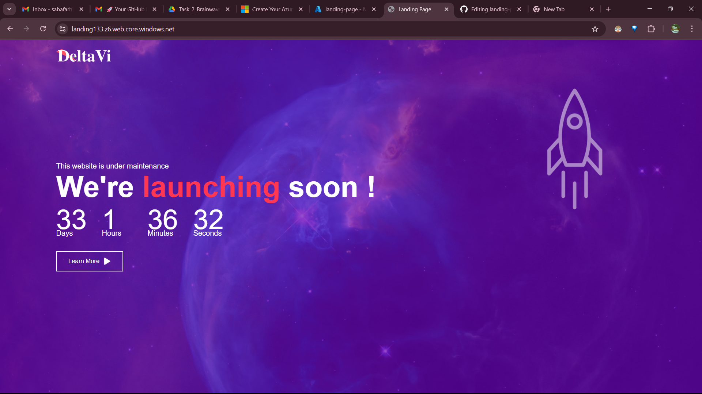

# ✈️ Aeroplane Landing Page

## 📌 Project Overview
This is a simple and visually engaging **landing page** built using **HTML and CSS**, featuring a **moving upward airplane animation**. It's designed as part of a cloud project demonstrating modern frontend techniques and cloud deployment workflows.

## 🚀 Features
- CSS animation of an upward-flying airplane ✈️
- Clean, responsive design
- Simple structure for educational and demonstration purposes

## ☁️ Cloud Hosting
This project highlights cloud hosting using two platforms:
- ✅ **Previously hosted on Microsoft Azure** (Static Web App)
- ✅ **Now hosted on Netlify** (for simplicity and GitHub integration)

## 🌐 Live Site
👉 

## 🛠️ Technologies Used
- HTML5
- CSS3
- Microsoft Azure (initial deployment)
- Netlify (current live hosting)

## 📷 Screenshots

